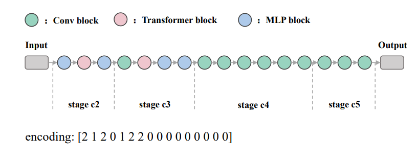

# HA-ENAS
Code accompanying the paper. 

## Requirements
``` 
Python >= 3.7.13 , PyTorch >= 1.11.0 , torchvision >= 0.12.0 , torchattacks >= 3.5.1 , timm >= 0.5.4  , tqdm 
```
## Usage

#### search

Collect supernet and place it to checkpoints, Then run 

```python
python search/cifar10_search.py
```

The log will be saved in the Job folder, where you can view the search process and results.

#### Best structure searched



The structure of ha-net-a1, with 94.79% accuracy on cifar10, has excellent robustness under multiple attacks.

### Architecture validation

To validate the results by training from scratch, run

```python
python validation/hanet_train.py
```

To validate the robustness under multiple attacks，run

```python
python validation/transfer_attack_test.py --batch_size 32 --test_model HA_Net
```

+ You may need to adjust the batch_size depending on your GPU memory.

+ You can modify the test_model to select the networks you want to test, the optional parameters are HA_Net,resnet50,vit and mixer. you need to put the weights of these networks in the checkpoints folder before you test them.

You can download checkpoints [here](https://drive.google.com/drive/folders/1x_PL5bmKxKHQYN8peaV7gY41lys7pA5y?usp=sharing)，and attacked dataset [here](https://drive.google.com/file/d/1sHvsOLv16uvYZg07zmg9dWDi9Eeo6wIh/view?usp=sharing).
